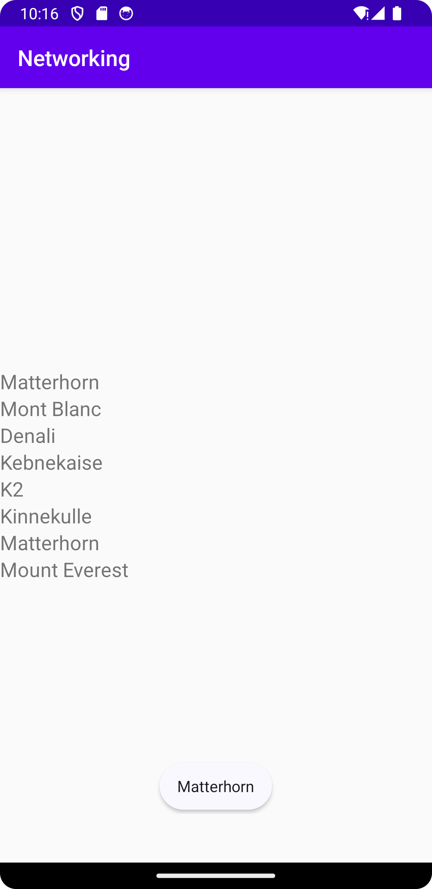

# Rapport
Skapade en RecyclerView till min layout, skapade en Mountain klass med medlemvariabler, getter och setters och konstruktor 
som innehåll. I MainActivity så lade jag till ArrayList<Mountain> och RecyclerView adapter som medlemsvariabler. 
Skapade även en layout-fil för mina items, skapade även en klass för RecyclerViewAdapter. Med hjälp av GSON kunde man också med 
JSON-data visa namn på andra namn på berg genom att använda sig av webtjänst,byta ut URL:n i medlemsvariabeln JSON_URL. 


```
   <androidx.recyclerview.widget.RecyclerView
        android:id="@+id/recycler_view"
        ... />
        
   package com.example.networking;

    public class Mountain {
        private String name;
        private String location;
        private int height;
    
        ... 
    
        public Mountain(String n, String l, int h) {
            this.name = n;
            this.location = l;
            this.height = h;
        }
    
        public Mountain(String name) {
            this.name = name;
        }
    
        public String getName() {
            return name;
        }
    
        public void setName(String name) {
            this.name = name;
        }
    
        public String toString() {
            return name;
        }
    }
    
    private Gson gson;
    private final String JSON_URL = "https://mobprog.webug.se/json-api?login=brom";
    
        public void onPostExecute(String json) {

        Log.d("Injerawot", json);

        Type type = new TypeToken<List<Mountain>>() {}.getType();
        List<Mountain> listOfMountains = gson.fromJson(json, type);
        items.clear();
        items.addAll(listOfMountains);
        for (int i=0;i< items.size();i++) {
            Log.d("Injeradoro", items.get(i).toString());
            recyclerViewItems.add(new RecyclerViewItem(items.get(i).toString()));
        }
        adapter.notifyDataSetChanged();
    }


   
```


